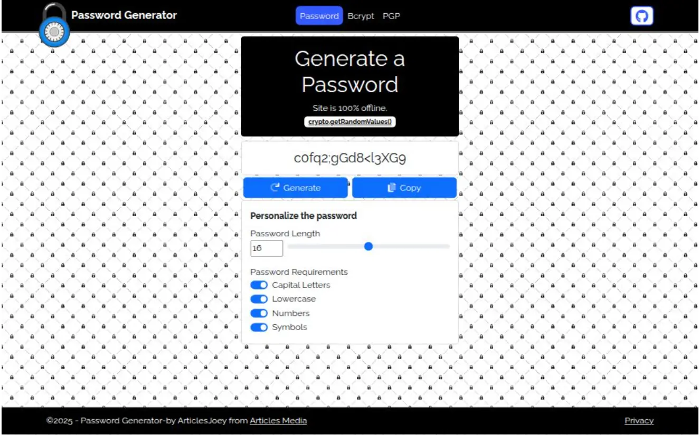

## Password Generator

Yet another password generation site. Can be used to generate and hash passwords. Can also be used to encrypt/decrypt PGP messages. All logic is kept offline.



## Getting Started

First, run the development server:

```bash
npm i --force
npm run dev
```

Open [http://localhost:3068](http://localhost:3068) with your browser to see the result.